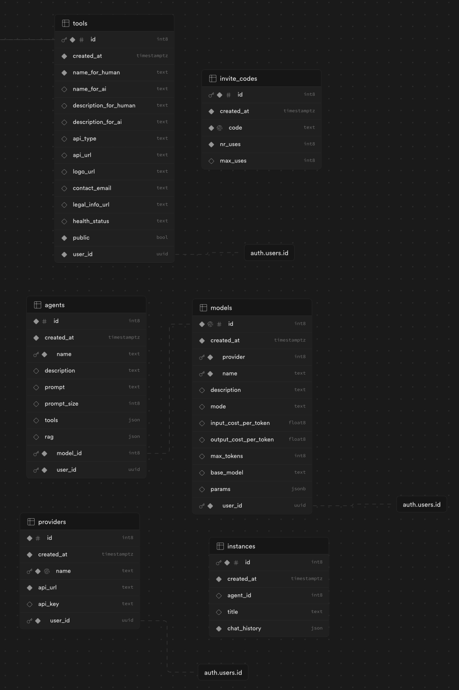

# Running Fyodorov locally
These directions are a WIP. If you run into questions please feel free to ask for help on the [Discord](https://discord.gg/ChCTeC8qwE).

## Docker Compose
This `docker-compose.yml` file will allow you to run the service locally. You can then access it at [http://localhost:8001](http://localhost:8001)

```yaml
version: '3'
services:
  gagarin:
    image: ghcr.io/fyodorovai/gagarin:main
    ports:
      - 8001:8000
    env_file: ./.env
    restart: always
```

## Supabase

The project uses Supabase for it's Postgres backend, as well as authentication. 
You will need an `.env` file like this one:
```shell
SUPABASE_PROJECT_URL=''
SUPABASE_API_KEY=''
JWT_SECRET=''
```
## Postgres
You will need to create the following tables:


